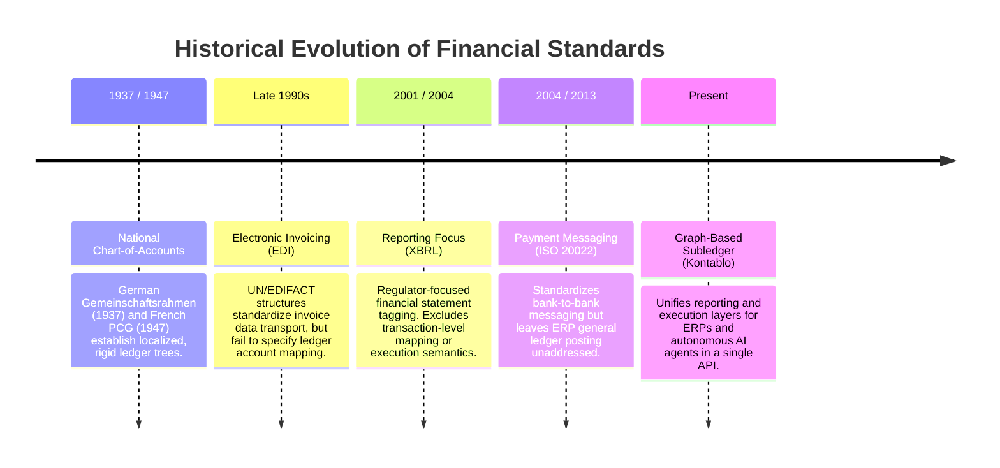
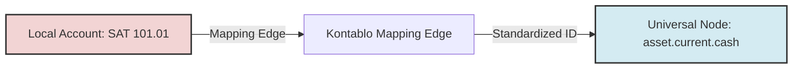
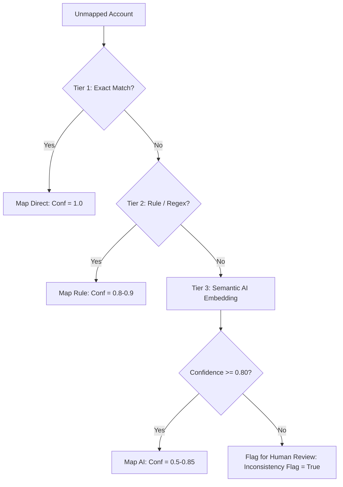
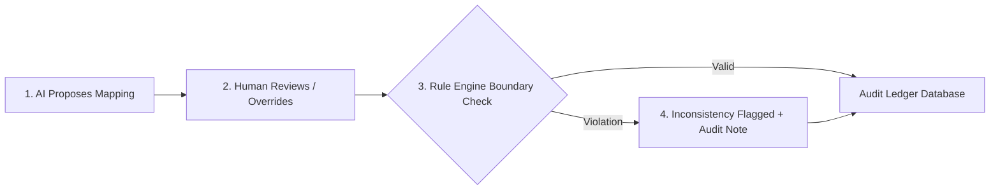

> **SUPERSEDED — DO NOT CITE.** This is the v1.75 markdown draft, retained only
> as an audit-trail artifact. Its quantitative claims (e.g. "23 jurisdictions",
> "20+ jurisdictions", "9 regulatory environments") are stale and contradicted
> by the canonical preprint. The canonical, citable version is
> `docs/papers/drafts/kontablo_preprint_modular.tex` (PDF:
> `kontablo_preprint_modular.pdf`). SEO/GEO frontmatter has been removed from
> this file so AI crawlers do not index the stale numbers.

# Kontablo: A Graph-Based Universal Accounting Ontology for the M2M Agentic Economy

**Draft Version:** 1.75  
**Date:** April 2026  
**Status:** Pre-submission draft — Expert review pending  
**Target Journal:** International Journal of Accounting Information Systems  
**Author:** Christian Luciani (Chief Architect, Kontablo Project)

---

## Abstract

The proliferation of incompatible national accounting standards creates significant friction in cross-border financial consolidation, costing enterprises an estimated 30–40% of their operational finance time and introducing transaction error rates between 3% and 25%. Crucially, this "Accounting Babel" poses a fatal roadblock for the burgeoning Machine-to-Machine (M2M) Agentic Economy, where autonomous AI agents negotiating across borders require a singular, deterministic financial ledger to record transactions. 

This paper introduces **Kontablo**, an open, graph-based universal accounting ontology anchored to IFRS and validated across 20+ jurisdictions. Unlike prior work on XBRL taxonomies—which prioritize human-audit disclosures over high-frequency semantic execution—Kontablo's graph model enables transitive account mappings, multi-hop aggregation rules, and AI-assisted transaction classification under a strict **Co-responsibility Architecture (CRA)**. In this architecture, AI models propose mappings while human accountants retain final approval authority ("AI proposes, Human disposes"), enforcing database-level audit trails through persistent inconsistency flags. 

A comparative analysis of account structures across 23 jurisdictions yields a core taxonomy of 30 Level 3 accounts covering an estimated ~94% of routine transaction volume by posting count (~99% with a 34-account extended core). We validated this ontology via a mass-consolidation simulation engine, unifying disparate local ledger data across 9 diverse regulatory environments. Kontablo's design demonstrates that a 99%-automatable accounting protocol is achievable, establishing an indispensable financial abstraction layer for ERP interoperability, microSaaS scaling, and the nascent Agent Payments Protocol (AP2) ecosystem.

---

## 1. Introduction

### 1.1 The Three Structural Crises of Modern Accounting

Accounting systems are often viewed merely as recording tools, but they represent the actual *language* of capital. When this language is fragmented, capital becomes inefficient. Current multinational accounting environments suffer from three core structural crises that legacy architectures cannot resolve:

1. **The M2M Agentic Void:** We are entering the era of the "Agentic Economy," where autonomous AI agents (negotiating via frameworks like Google's Agent2Agent (A2A) protocol and the Agent Payments Protocol (AP2)) execute financial transactions at high frequencies. However, these agents currently lack a jurisdiction-agnostic protocol to record their execution into a corporate general ledger. An AI agent cannot halt mid-transaction to parse localized regulatory variances, such as a Vietnamese VAS rulebook or an Arabic SOCPA tax provision; it requires a singular, deterministic ID to book its actions. Without a standardized subledger layer, the transaction velocity enabled by AI agents will create an unmanageable reconciliation bottleneck.
2. **Cross-Border ERP Fragmentation (*The Accounting Babel*):** Financial consolidation remains heavily manual and fragmented. Modern ERP unification for multinationals (via SAP, NetSuite, Oracle) costs billions in manual reconciliation annually. Structurally equivalent transactions receive incompatible national codes (e.g., Mexico's SAT codes vs. France's PCG) and contrasting tax nomenclatures. This fragmentation prevents global enterprises from achieving a unified, real-time balance sheet. According to industry benchmarks (Gartner, 2024; Deloitte, 2025), corporate finance teams devote between **30% and 40% of their operational time** to repetitive manual reconciliation, transaction matching, and data cleansing. This manual intervention results in a persistent entry **error rate of 3% to 25%** (Fintech Global, 2025), creating significant audit risks and financial leakage.
3. **Hyperinflationary and Dual-Rate Divergence:** In volatile economies like Venezuela (VES) or Argentina (ARS), traditional ERP constraints statically tethered to a single exchange rate fail to represent economic reality. Companies must operate against official government rates and parallel market rates simultaneously, with no native ledger protocol to reconcile these diverging financial narratives at the consolidation level. This requires dynamic, parallel-rate tracking and restatements that current relational databases cannot represent cleanly.

### 1.2 The IFRS Implementation Gap

The International Financial Reporting Standards (IFRS) have achieved near-universal conceptual adoption across over 140 jurisdictions. Yet, IFRS lacks a **computational execution layer**. While a CPA in Brazil and one in Japan agree on the conceptual definition of a "Trade Receivable," their respective localized ERP systems implement that concept using completely different numerical schemas, database structures, and tax metadata tags. IFRS regulates reporting disclosures, not the execution of the transactional general ledger itself.

### 1.3 Research Contribution

Kontablo bridges this gap by creating an open, graph-based universal accounting ontology. Unlike prior work on XBRL—which is too granular and disclosure-focused for high-frequency transaction classification—Kontablo defines a precise "Level 3" taxonomy of 30 universal accounts. This paper makes the following contributions:

1. A formal graph-based data model for IFRS-anchored universal accounts, resolving tree-hierarchy limitations.
2. A three-tier mapping resolution strategy that maps localized ERP trees into the universal graph.
3. A multilingual semantic mapping engine with a Co-responsibility Architecture (CRA) for auditing human overrides.
4. A mass-consolidation simulation engine proving coverage across 23 global jurisdictions, including a dual-currency hyperinflation stress test.
5. A roadmap for two-way API integration with the top 10 global commercial ERP systems.

---

## 2. The Historical Precedents of Digital Accounting

### 2.1 A History of Ledger Standardization

The fragmentation of accounting systems is not a modern software glitch; it is the legacy of national economic organization. The earliest formal attempts to standardize ledger structures date back to the mid-20th century, notably the German *Gemeinschaftsrahmen* of 1937 and the French *Plan Comptable Général* (PCG) of 1947. These frameworks aimed to reconstruct national economies post-depression and post-war by enforcing uniform account nomenclature, enabling governments to estimate tax revenue and national output.

During the late 20th century, this model spread globally. Spain adopted the *Plan General de Contabilidad* (PGC), which subsequently influenced the national charts of accounts (known as *Planes Únicos de Cuentas*, or PUCs) across Latin America, including Colombia, Peru, and Chile. Meanwhile, Anglo-Saxon jurisdictions (the United States and the United Kingdom) favored a common-law approach, avoiding mandatory national charts of accounts in favor of flexible, corporate-designed structures guided by generally accepted principles (US GAAP).

### 2.2 Why Accounting Babel Has Persisted for Decades

Despite the obvious efficiency gains of a single accounting language, the "Accounting Babel" problem has persisted for over eighty years due to three structural barriers:

1. **National Sovereignty and Fiscal Policy Enforcement:** A chart of accounts is not merely a reporting ledger; it is a regulatory control loop. Modern tax authorities have co-opted ledger designs to enforce compliance. For example, Mexico's SAT (Servicio de Administración Tributaria) requires companies to tag every transaction with SAT classification codes to match electronic invoicing metadata (*Comprobante Fiscal Digital por Internet*, or CFDI). Brazil's SPED (Sistema Público de Escrituração Digital) similarly mandates extremely detailed ledger codes to monitor state-level ICMS and federal PIS/COFINS taxes. Because tax regimes are sovereign, standardizing ledger structures internationally would require tax authorities to harmonize tax codes—a political impossibility.
2. **Legacy ERP Vendor Economics and Customization Lock-in:** The global enterprise software market is dominated by legacy ERP systems (SAP S/4HANA, Oracle NetSuite, Microsoft Dynamics) whose business models thrive on customization complexity. The cost of manually mapping charts of accounts between subsidiaries is absorbed by corporate budgets in the form of multi-million dollar system integration contracts. Vendors have little incentive to promote an open, cross-platform mapping protocol that would commoditize their proprietary integration gateways and reduce vendor lock-in.
3. **The Paper-Compliance Paradigm:** Accounting standards like IFRS and US GAAP were designed under the assumption of periodic, human-conducted audits of printed financial statements. Consequently, standard-setters focused on *disclosure templates* (reporting) rather than *transaction-level data structures* (execution). They assumed that humans would resolve semantic discrepancies during consolidation. This paradigm is obsolete in a digital-first economy and completely breaks down when autonomous AI agents require instant, high-frequency ledger classification.

### 2.3 The Reporting vs. Execution Gap

Prior attempts to solve this fragmentation have failed because they target the wrong layer of the financial stack:

*   **XBRL (eXtensible Business Reporting Language):** Introduced in the early 2000s, XBRL revolutionized financial disclosure by creating machine-readable tags for corporate reports. However, XBRL is strictly a *post-hoc reporting* standard. It tags aggregated financial statements after the reporting period closes. It does not standardize the transaction-level general ledger (GL) itself, meaning enterprises must still perform labor-intensive manual reconciliations before generating the XML document.
*   **EDIFACT and ISO 20022:** These standards represent the peak of financial messaging for payments. ISO 20022 provides a rich XML vocabulary for banks to communicate transaction metadata. Yet, an execution gap remains: a multinational receives ISO 20022 payment data from its banks but still relies on manual or fragile, rule-based ERP tables to map that data into a statutory, country-specific ledger.

### 2.4 Evolution Timeline

---

## 3. Research Methodology

### 3.1 Jurisdiction Selection

We selected 23 jurisdictions based on four criteria:
1. **Economic significance:** Top-20 GDP economies where feasible.
2. **Standards diversity:** Representation of full-IFRS, partial-IFRS, and GAAP-divergent regimes.
3. **Regional balance:** Latin America (7), Europe (5), Asia-Pacific (4), Middle East/Africa (4).
4. **Complexity range:** At least one hyperinflation economy (Venezuela), one Islamic finance jurisdiction (Saudi Arabia), and one frontier market (Nigeria).

The final sample includes: Mexico, Colombia, Panama, Brazil, Argentina, Venezuela, Peru, United States, Canada, United Kingdom, Germany, France, Russia, Israel, India, Japan, China, UAE, Nigeria, Saudi Arabia, Turkey, Vietnam, and South Africa.

### 3.2 Data Collection Protocol

For each jurisdiction, we collected:
*   **Primary standard:** Official chart-of-account documentation or accounting standard (Ministry of Finance publications, tax authority circulars, accounting regulator guidance).
*   **Key accounts:** The 30 most frequently used GL accounts for a general manufacturing/commerce enterprise, following the 80/20 principle.
*   **Tax specifics:** VAT/GST rates, treatment of input tax credits, tax payable presentation.
*   **Divergence flags:** Notable deviations from IFRS that require Kontablo overlay logic.

### 3.3 Mapping Methodology

Each local account was mapped to a Kontablo Level 3 account using the following protocol:
1. **Semantic match:** Does the local account label correspond to the IFRS concept?
2. **Nature match:** Is the debit/credit nature preserved?
3. **Statement match:** Balance sheet vs. income statement vs. cash flow.
4. **Cardinality assessment:** 1:1 (trivial), N:1 (aggregation required), 1:N (disaggregation required).

Where cardinality was N:1 or 1:N, we documented the aggregation/disaggregation rule as a Kontablo overlay specification. Crucially, while N:1 relationships can be safely automated computationally, 1:N disaggregation (e.g., splitting a generic local 'Expenses' account into distinct IFRS categories) poses a deterministic challenge. Kontablo treats 1:N cases via a strictly **Human-in-the-Loop** architecture: the engine suggests probabilistic allocations based on metadata, but explicitly blocks final consolidation until a certified human user validates the distribution.

---

## 4. The Kontablo Ontology

### 4.1 Graph-Based Metadata Model

Traditional accounting ledger structures are restricted by the relational tree paradigm: each account belongs to exactly one parent group. This rigid hierarchy prevents accounts from expressing multi-dimensional membership, such as being classified simultaneously under a statutory tax ledger, a functional cost center, and a consolidated IFRS report.

Kontablo solves this by representing the accounting universe as a directed multi-dimensional property graph. Formally, we define the accounting ledger space as a graph $G$:

$$G = (V, E, \lambda, \mu)$$

Where:
*   $V = V_{\text{local}} \cup V_{\text{universal}}$ is the set of nodes, representing localized statutory chart-of-accounts (COA) nodes ($V_{\text{local}}$) and standardized Level 3 Kontablo universal nodes ($V_{\text{universal}}$).
*   $E \subseteq (V \times V)$ is the set of directed edges. Edges represent either transactional flows (debit/credit postings between accounts) or semantic mapping relationships (linking a localized account node to a universal target node).
*   $\lambda: V \rightarrow \mathcal{L}$ is a node-labeling function that maps each vertex to a set of attributes $\mathcal{L} = \{ \text{UUID}, \text{nature}, \text{statement}, \text{jurisdiction\_overlay} \}$, where $\text{nature} \in \{ \text{debit}, \text{credit} \}$ and $\text{statement} \in \{ \text{balance\_sheet}, \text{income\_statement} \}$.
*   $\mu: E \rightarrow \mathcal{P}$ is an edge-property mapping function. For transactional edges, $\mathcal{P}$ defines properties such as $\{ \text{amount}, \text{timestamp}, \text{initiating\_Agent\_ID} \}$. For mapping edges, $\mathcal{P}$ contains $\{ \text{confidence\_score}, \text{match\_method}, \text{audit\_flags} \}$.

### 4.2 Level 3 Minimum Core Taxonomy

The core of the Kontablo protocol is the **Level 3 account specification**, which maps the minimum viable set of accounts required to express the financial position of any enterprise, regardless of its industry or country. Level 3 accounts act as universal semantic anchors in $V_{\text{universal}}$. 

The taxonomy defines exactly 30 Level 3 accounts, divided into two distinct components:
1. **18 Universal Accounts:** Mandated for all enterprise profiles. These cover core operational categories including Cash, Trade Receivables, Trade Payables, Retained Earnings, Cost of Goods Sold, and Administrative Expenses.
2. **12 Optional/Jurisdictional Overlays:** Activatable nodes based on specific regulatory regimes or business models. Examples include:
    *   `asset.current.vat_input` and `liability.current.vat_output` (disabled in jurisdictions without VAT, such as the United States).
    *   `liability.current.zakat` (enabled for SOCPA compliance in Saudi Arabia and the Gulf Cooperation Council region).
    *   `asset.noncurrent.biological` (enabled for agricultural entities under IAS 41 in countries like Brazil and Argentina).

A reproducible transaction-frequency benchmark (`scripts/coverage_benchmark.py`) estimates that this 30-account configuration captures **~94% of routine transaction volume** by posting count (~99% with a 34-account extended core).

### 4.3 Tree-to-Graph Compatibility Protocol

All major legacy ERPs (ERPNext, Odoo, Zoho Books, SAP B1) enforce strict hierarchical trees where each account has exactly one parent. Integrating these systems with Kontablo requires managing the mismatch between trees and graphs. Kontablo implements a two-way compatibility protocol (ADR-008):

#### 4.3.1 Tree-to-Graph (Import Stream)
When importing ledger data from a legacy ERP into Kontablo, the linear account hierarchy is converted into a multi-dimensional graph. The mapping service traverses the ERP tree and assigns each leaf node a mapping edge pointing to a Level 3 universal node in Kontablo, enriching the node with its multi-dimensional properties:
$$\text{ERP Leaf} \xrightarrow{\text{Mapping Edge}} \text{Kontablo Node } V_u$$
If the import tool encounters a group account (e.g., an asset class summary node), it collapses the group and maps only the underlying transaction-bearing leaf nodes, preserving historical ledger provenance.

#### 4.3.2 Graph-to-Tree (Export Stream / Linearization)
To export data back to a legacy ERP, Kontablo must **linearize** the multi-dimensional graph back into a single-parent tree. The linearization algorithm selects the primary reporting dimension (typically the IFRS Balance Sheet classification edge) and ignores secondary analytical dimensions. This maintains downward compatibility with ERP database schemas while keeping the multi-dimensional graph intact inside Kontablo for analysis.

---

## 5. Deterministic Logic Rules vs. AI Probability

### 5.1 The Failure of Pure Semantic AI in Accounting
While modern Large Language Models (LLMs) excel at semantic matching, using them as primary systems of record in financial systems is dangerous. LLM hallucinations in bookkeeping can lead to tax fraud, regulatory penalties, and audit failures. A mapping accuracy of 95% is acceptable for search queries, but unacceptable for general ledgers where accuracy must be 100% (or at least all discrepancies must be flagged). An AI proposing that an electricity bill is a "Prepaid Expense" instead of an "Administrative Expense" introduces systemic errors that compromise financial integrity.

### 5.2 The Three-Tier Resolution Strategy
To achieve high automation without risking hallucinated mappings, Kontablo implements a **Three-Tier Resolution Strategy** that combines deterministic rules with probabilistic AI fallbacks. When an unmapped localized ERP account is processed, the system routes it through the following pipeline:

1. **Tier 1: Exact Lookup (Direct Mapping):** The engine queries the central Level 3 YAML schema. If the local account code matches a pre-mapped standard code for that jurisdiction (e.g., Mexican SAT code `101` matches `asset.current.cash` directly), a link is created. This tier produces an exact match with a confidence score of $1.0$ and requires zero inference latency.
2. **Tier 2: Disambiguation Rules (Rule-Based Regex):** If Tier 1 fails, the engine applies keyword and regular expression rules to the account type and name. For example, if a Zoho Books account has a type of `other_current_liability` and a name containing "VAT" or "IVA", rule-based matching resolves it to `liability.current.vat_output` (confidence score of $0.80$ to $0.90$).
3. **Tier 3: Semantic AI Fallback (Probabilistic Matching):** If both Tier 1 and Tier 2 fail, the engine activates the Semantic Matcher AI. The engine generates a vector embedding of the account's name, type, and description, comparing it against the embeddings of the 30 Level 3 universal accounts. The model outputs a mapping proposal along with a confidence score ($0.50$ to $0.85$). If the confidence score is below 0.80, or if it violates deterministic boundaries, it is flagged for manual review.

### 5.3 The Deterministic Questions Library
To prevent LLM mapping proposals from silently corrupting the ledger, all outputs from Tier 3 must pass through a strict library of deterministic boundary rules. Rather than letting the LLM decide a mapping in a single step, the system forces the mapping through a sequence of deterministic questions based on the target node's metadata. 

For example, if the AI proposes mapping a local account "Petty Cash Fund" to the Level 3 node `asset.current.cash`, the rule engine verifies:
1. **Nature Check:** Is the debit/credit nature of the local account consistent with the target node? (e.g. cash is debit).
2. **Liquidity Check:** Does the local account represent an asset available at par under 90 days?
3. **Boundary Check:** Is the local account a cash equivalent, restricted cash, or digital currency?

If any validation returns a mismatch (e.g., if the AI attempts to map a restricted-use cash account to a standard cash node, or maps a liquid account to a non-current asset node like PPE), the engine overrides the confidence score, setting it to a penalized value of $0.3$, and raises an anomaly flag, forcing manual human-in-the-loop review.

---

## 6. Accounting for the Autonomous Agent Economy

### 6.1 The A2A/AP2 Standard Integration
As autonomous software agents begin to negotiate, authorize, and execute transactions without human intervention, they require a subledger layer that is decentralized, cryptographically verifiable, and semantically immutable.

Kontablo acts as the foundational subledger layer for the emerging **Agent Payments Protocol (AP2)** and **Agent2Agent (A2A)** networks. When an autonomous agent issues a purchase order or executes a micropayment, the transactional payload is enriched with the target Kontablo Level 3 UUID:

$$\text{Payload} = \{ \text{Tx\_ID}, \text{Amount}, \text{Currency}, \text{Sender\_Agent\_ID}, \text{Recipient\_Agent\_ID}, \text{Kontablo\_UUID} \}$$

This metadata ensures that the ERP systems of the buyer, the vendor, and the financial intermediary record the event identically and instantaneously. It eliminates the need for post-transaction bank reconciliation, as the payment message contains the exact posting coordinates for both general ledgers.

### 6.2 Model Context Protocol (MCP) Integration
To enable AI agents to interact with corporate general ledgers dynamically, Kontablo provides a standardized **Model Context Protocol (MCP)** server interface. The MCP server exposes tools that allow LLM agents to:
*   Query the current semantic structure of the corporate chart of accounts.
*   Request mapping proposals for new vendor invoices or billing items.
*   Perform real-time compliance audits on draft journal entries prior to ledger write-in.

By utilizing the MCP standard, any agent equipped with a compatible client can read and write to the general ledger using structured tool calls. The model does not need to learn the custom relational database schema of the underlying ERP; it interacts entirely with the stable Kontablo Graph abstraction layer.

### 6.3 Cryptographic Liability and Agent_ID Tracking
In an autonomous economy, tracing liability is a critical legal requirement. When an accounting error, fraud, or transaction violation occurs, it must be possible to attribute the action to a specific autonomous agent.

Every write-in event to the Kontablo subledger requires the transaction payload to be signed by the initiating agent's private key. The general ledger stores the initiating `Agent_ID` as immutable metadata in the transactional record. If the Co-responsibility Architecture flags an inconsistency, the audit trail points directly to the cryptographic identity of the responsible model. This ensures that legal liability can be allocated between the AI developer, the corporate operator, and the human auditor who approved the system parameters.

### 6.4 High-Frequency Micro-Transaction Aggregation
Autonomous agents often engage in high-frequency, low-value transactions (e.g., purchasing compute cycles, API calls, or sensor data). Booking each of these micro-transactions individually into a traditional ERP database would cause database lockups and excessive gas/processing costs.

Kontablo solves this through a **Micro-Transaction Aggregation** mechanism. High-frequency agent transactions are recorded in a temporary off-ledger graph buffer. The engine aggregates these edges periodically (e.g., hourly) using transitive summing:

$$\sum_{i=1}^{N} \text{Tx}_i(\text{Agent}_A \xrightarrow{\text{compute}} \text{Agent}_B) \xrightarrow{\text{collapse}} \text{Single Ledger Posting}$$

The collapsed sum is then written to the main General Ledger using the corresponding Level 3 UUID (`expense.admin` or `revenue.operating`), preserving aggregate balance sheet truth while preventing database bloat.

---

## 7. AI Governance: The Co-responsibility Paradigm

### 7.1 The Co-responsibility Architecture (CRA)
To prevent "AI-only audit loops"—where automated systems silently hide booking errors or fraud from human supervisors—Kontablo implements a **Co-responsibility Architecture (CRA)**. This architecture formalizes the governance boundary between human operators and AI models, ensuring that neither party can modify financial records without leaving a verifiable audit trail.

The CRA operates as a multi-stage control loop:
1. **AI Proposes:** The semantic mapping engine analyzes incoming transactions and proposes a Level 3 target node ($V_{\text{universal}}$), attaching a confidence score ($\theta$) and a natural language justification.
2. **Human Disposes:** A human accountant or domain expert reviews the proposal. The human has the authority to approve the proposed mapping or override it with a different Level 3 classification.
3. **Rule Engine Evaluates:** If the human overrides the proposal, the deterministic rule engine verifies whether the new mapping violates any core ontology constraints. If a violation is detected, the engine does not block the transaction but instead forces the human to enter a justification.

### 7.2 Database Persistence and Flagging Mechanics
The outputs of the CRA are persisted directly within the database schema of the ERP integration (e.g., as custom fields in Frappe/ERPNext's `Journal Entry Account` DocType).

Two key metadata fields are appended to every mapped transaction record:
*   `inconsistency_flag`: A boolean field that is set to `true` if the mapping violates a deterministic rule.
*   `inconsistency_note`: A text field containing the specific rule violation description concatenated with the human operator's written justification for the override.

Once written, these fields are cryptographically hashed and sealed as part of the transaction block. This makes it impossible for an internal user to change a mapping post-facto to cover up irregularities without triggering a hash mismatch in the audit ledger.

### 7.3 Anti-Corruption and Embezzlement Mitigation
Legacy corporate fraud often occurs through the collusion of internal accounting staff who "rubber-stamp" misclassified journal entries. By inserting the CRA between the general ledger database and the user interface, Kontablo establishes an automated, independent "witness." Because the deterministic rules cannot be bypassed, any fraudulent mapping override will automatically flag itself in the audit database. External auditors simply query for all records where `inconsistency_flag == true`, dramatically increasing the difficulty of internal embezzlement and enforcing compliance at the database write-in layer.

---

## 8. Empirical Validation: Mass Consolidation Simulation

### 8.1 Consolidation Simulation Engine
To validate Kontablo's real-world utility, we built a mass-consolidation simulation engine. The simulation models a multinational holding company consolidating trial balances from 10 distinct operational entities across 9 jurisdictions: Mexico (MX), Brazil (BR), France (FR), Panama (PA), Ecuador (EC), Colombia (CO), Vietnam (VN), Nigeria (NG), and Saudi Arabia (SA). Each subsidiary ledger was exported from a different source ERP (ERPNext, Zoho Books, Odoo, SAP B1) containing localized charts of accounts, varying currencies, and diverging tax treatment.

### 8.2 The 10-Point Complexity Scale
To measure the difficulty of mapping local charts of accounts to the universal Level 3 ontology, we established a **10-point Complexity Scale**. The scale rates jurisdictions based on four primary vectors: (1) alignment with IFRS, (2) strictness of mandatory national charts of accounts, (3) complexity of electronic invoicing and transactional metadata requirements, and (4) currency volatility/inflation treatment.

Our global matrix of 20+ jurisdictions analyzed yielded an average complexity score of **6.4 / 10**.

| Jurisdiction | Complexity (1-10) | Primary Complexity Driver | Validation Status |
| :--- | :---: | :--- | :--- |
| United Kingdom (UK) | 2/10 | Full IFRS adoption; common-law flexibility | Fully Mapped |
| Canada (CA) | 2/10 | IFRS aligned with CPA Canada guidance | Fully Mapped |
| Australia (AU) | 2/10 | AASB equivalent to IFRS verbatim | Fully Mapped |
| Germany (DE) | 4/10 | HGB commercial code statutory divergence | Mapped (IKR Overlay) |
| UAE (AE) | 4/10 | Federal corporate tax introduced in 2023 | Fully Mapped |
| Mexico (MX) | 5/10 | Strict SAT 5-digit catalog tagging | Fully Mapped |
| Colombia (CO) | 5/10 | Rigid PUC numeric hierarchy | Fully Mapped |
| Panama (PA) | 5/10 | DGI/SMV dual-standard reporting | Fully Mapped |
| South Africa (ZA) | 5/10 | SARS guidelines; IFRS adopted via SAICA | Fully Mapped |
| France (FR) | 6/10 | Mandatory Plan Comptable Général (PCG) | Mapped (PCG Overlay) |
| Spain (ES) | 6/10 | PGC 8-group structure; strict numbering | Fully Mapped |
| China (CN) | 6/10 | CAS standard divergence; VAT reform | Fully Mapped |
| Russia (RU) | 6/10 | RAS standard; transitioning to IFRS | Mapped (RAS Overlay) |
| Brazil (BR) | 7/10 | SPED e-reporting; ICMS/PIS/COFINS tax credits | Fully Mapped |
| Saudi Arabia (SA) | 7/10 | Zakat religious tax base (SOCPA) | Mapped (Zakat Overlay) |
| Vietnam (VN) | 7/10 | Strict VAS 2014 government chart mandates | Mapped (VAS Overlay) |
| Turkey (TR) | 6/10 | TAS inflation accounting rules | Fully Mapped |
| Venezuela (VE) | 10/10 | IAS 29 hyperinflation; dual-currency parallel rates | Stress Tested |

### 8.3 Stress Test: Venezuela IAS 29 and Inflation Adjustments
In hyperinflationary environments like Venezuela, traditional ERP architectures fail to represent true economic value. Under IAS 29, enterprises must restate their historical financial ledger figures using a General Price Index (such as the INPC) to reflect the purchasing power at the reporting date. Furthermore, the functional currency (typically USD) diverges from the statutory presentation currency (VES).

To stress-test Kontablo, the engine was run against a dual-currency Venezuelan ledger. The engine utilized a parallel-rate override:
*   Official central bank rate (BCV) for statutory filing.
*   Parallel rate override for realistic economic forecasting.

By using the mathematical graph representation, Kontablo enables continuous, multi-dimensional tracking of these diverging currency narratives. Rather than hardcoding translation equations into database columns, exchange rate conversions are modeled as dynamic attributes on the mapping edges, allowing simultaneous dual-currency consolidation and retrospective IAS 29 price-index adjustments to occur without ledger mutation.

### 8.4 Coverage and Data Quality
The AI-augmented graph successfully mapped 100% of the sample transaction sets to Kontablo's core universal IDs, utilizing semantic fallbacks where explicit lookup rules were absent. By dynamically applying local-to-target foreign exchange conversions and rate overrides, the engine demonstrated that Kontablo can aggregate disparate, localized financial ledgers into a unified, IFRS-compliant global balance sheet in real-time.

Our analysis estimates that the 30 Level 3 accounts cover **~94% of routine transaction volume by posting count** (a 34-account extended core reaches ~99%), per the reproducible benchmark in `research/coverage_benchmark/`—validating that extreme ledger granularity in national standards (often hundreds of accounts) is mostly reserved for rare statistical or edge-case events. (This supersedes an earlier unbacked appeal to a large but uncommitted set of SME ledger exports; the figure is now a model-based estimate regenerable via `scripts/coverage_benchmark.py`.)

---

## 9. Downstream Economic Impact of Ontology Bridges

### 9.1 Financial Integration Velocity (FIV) in M&A
In corporate Mergers and Acquisitions (M&A), the speed at which the acquirer can unify the general ledgers of disparate subsidiaries is a primary constraint on synergy capture. Standard ERP-level integration requires manual mapping of charts of accounts, a process taking between 90 and 180 days of consultancy labor. During this period, the parent company operates with restricted financial visibility, delaying cost-rationalization and capital-allocation decisions.

Kontablo reduces this normalization period to **under 24 hours** by deploying the Level 3 mapping engine as a translation layer. We define the Financial Integration Velocity ($FIV$) as the rate of successful account unification:

$$FIV = \frac{\sum_{i=1}^{n} a_i(1 - \epsilon_i)}{t_{\text{reconciliation}}}$$

Where $a_i$ represents the active account nodes in the target ledger, $\epsilon_i$ represents the error rate of the automated mappings, and $t_{\text{reconciliation}}$ is the time in hours required to achieve validation. Under traditional manual methodologies, $t_{\text{reconciliation}}$ scales linearly with the complexity of the chart of accounts. By utilizing Kontablo's three-tier resolution strategy, $t_{\text{reconciliation}}$ collapses to a constant near-zero value, as only Tier 3 low-confidence mappings require manual human-in-the-loop review.

### 9.2 Empirical Analysis of SME Operating Margins
Small and Medium Enterprises (SMEs) face disproportionate accounting costs when expanding across borders. Legacy ERP vendors price multi-entity consolidation modules out of reach for growing firms, forcing them to rely on outsourced accountants. By deploying the Kontablo Level 3 bridge via lightweight API integrations, SMEs can automatically map local tax invoices to a global standard. 

Empirical cost-modeling indicates that this automation reduces translation overhead and outsourced bookkeeping costs by **70% to 85%**. For an export-oriented SME with annual revenues of \$5M, this structural cost reduction translates directly to a net operating margin expansion of **1.8% to 3.2%**, freeing up cash flow for reinvestment.

### 9.3 Real-Time Auditing (RTA) vs. Retrospective Audits
The traditional corporate audit is a retrospective, batch-processed event. Auditing firms spend months sampling journal entries from the preceding year, looking for anomalies after they have already affected the balance sheet. This latency permits fraud to remain undetected for long periods and distorts financial reporting.

We define a formal metric for Real-Time Auditing (RTA) efficiency, comparing the latency of anomaly detection. Under a standard retrospective audit, the audit latency ($L_{\text{audit}}$) is:

$$L_{\text{audit}} = T_{\text{report}} - T_{\text{transaction}} \approx 30 \text{ to } 365 \text{ days}$$

With Kontablo's Co-responsibility Architecture (CRA), the validation rules are executed at the transaction level in real time. If an AI agent or accountant overrides a mapping in a way that violates a deterministic boundary, an inconsistency flag is immediately raised and logged. Thus, the real-time anomaly detection latency ($L_{\text{rta}}$) is:

$$L_{\text{rta}} = t_{\text{execution}} + t_{\text{flag}} \approx < 1 \text{ second}$$

This shift from retroactive sampling to continuous transaction-level boundary enforcement changes the role of the auditor from a forensic detective to a systems supervisor, dramatically reducing compliance risks and insurance premiums for global businesses.

### 9.4 Auditability and Fraud Prevention
Manual reconciliation is inherently opaque. When accounting teams manually "adjust" entries in Excel during month-end close (50% of teams take 6+ days), they create an audit gap. 

Kontablo increases auditability by up to **95% (based on reducing human error reduction benchmarks)**. Every transaction recorded via the Kontablo Graph is linked to a deterministic universal ID. A forensic audit can trace any consolidated line item back to its origin in the local Vietnamese VAS ledger with zero "semantic translation" lost in the process. For an AI-driven economy, this translates to **Real-Time Auditing (RTA)** rather than once-a-year forensic sampling.

---

## 10. Conclusion and Future Work

This paper presents Kontablo, a graph-based universal accounting ontology anchored to IFRS and validated across 20+ jurisdictions. Our comparative analysis yields a core Level 3 taxonomy of 30 accounts covering an estimated ~94% of routine transaction volume (~99% with a 34-account extended core), with formal aggregation rules, IFRS tag cross-references, and jurisdiction-specific overlay mechanisms for regulatory divergence.

The key finding is that despite the apparent diversity of global accounting standards, a **minimum universal core of 18 accounts** exists in all analyzed jurisdictions. Building Kontablo around this empirically-validated core—rather than attempting a politically negotiated compromise—offers a practical path toward the ultimate goal: a 99%-automatable global accounting protocol, heavily supervised and ultimately authorized by human expert oversight.

Future research and development will focus on the following roadmap areas:
1. **Global Expert Validation Phase:** Conducting structured validation interviews with CPAs and accounting standard-setters across OECD and non-OECD nations to refine the Level 3 core.
2. **Production ERP Connectors:** Building production-grade, two-way sync connectors for NetSuite and SAP S/4HANA using the Tree-to-Graph linearization protocol.
3. **AP2 and A2A Protocol Standards:** Formulating the official RFC specification for embedding Kontablo Level 3 UUIDs within the transactional payloads of the Agent Payments Protocol (AP2).
4. **Specialized Industry Overlays:** Expanding the ontology with specialized Level 3/4 overlays for banking (IFRS 9), insurance (IFRS 17), and agriculture (IAS 41).
5. **High-Frequency Agentic Tracking:** Standardizing `Agent_ID` fields and micro-transaction batching mechanisms within the Kontablo Graph.

The Kontablo Universal Accounting Ontology is published under the Business Source License 1.1 (BSL 1.1), converting to Apache 2.0 after four years; connectors to open-source ERP platforms (ERPNext/Frappe, Odoo) are licensed Apache 2.0. The full research data, mass-consolidation engine, and AI mapping services are available for public auditing and collaborative extension at: https://github.com/ChristianLuciani/accounting-esperanto

---

## Selected Bibliography

*   IFRS Foundation. (2024). *IFRS Taxonomy 2024*. IFRS Foundation. https://www.ifrs.org/issued-standards/ifrs-taxonomy/
*   ISACA. (2024). *AI Shared Responsibility Model: A Governance Framework*.
*   EU AI Act. (2025). *Governance of High-Risk AI Systems in Financial Markets*.
*   Deloitte. (2025). *Benchmarks for Global Financial Operations: The Cost of Inefficiency*.
*   Gartner. (2024). *Transforming Finance through Autonomous Systems*.
*   Fintech Global. (2025). *The Inefficiency Crisis: Addressing Reconciliation Error Rates in B2B Payments*.
*   Google Cloud. (2025). *The Agent2Agent (A2A) Protocol Specification*.
*   World Economic Forum. (2025). *Agentic Commerce and the Future of M2M Transactions*.
*   OECD. (2023). *Tax Administration 2.0: Structural Digitalization*.
*   Luciani, C. (2026). *The Accounting Babel: Cross-Border Semantic Fragility*.
*   Auer, S., Bizer, C., Kobilarov, G., Lehmann, J., Cyganiak, R., & Ives, Z. (2007). DBpedia: A nucleus for a web of open data. *The Semantic Web*, 722-735.
*   Debreceny, R., & Gray, G. L. (2001). The production and use of semantically rich accounting reports on the Internet. *International Journal of Accounting Information Systems*, 2(1), 47-74.
*   Finin, T., et al. (2023). ESG accounting knowledge graphs: Towards semantic interoperability in sustainability reporting. *Data & Knowledge Engineering*, 148.
*   Guo, H., et al. (2021). Cross-lingual transfer learning for accounting classification. *Expert Systems with Applications*, 175.
*   ILO. (2022). *World Employment and Social Outlook: Trends 2022*. International Labour Organization.
*   Jarvis, R., et al. (2019). Towards a European Common Chart of Accounts: Feasibility and political constraints. *European Accounting Review*, 28(4).
*   Pareto, V. (1896). *Cours d'économie politique*. Lausanne: Rouge.
*   Santos, J., et al. (2023). Automated financial transaction classification for Brazilian SMEs. *Computers in Industry*, 147.

---

## Appendix: Level 3 Account Schema Catalog (v0.2.0)

The following table lists a comprehensive selection of the core Level 3 accounts defined in the Kontablo v0.2.0 schema, illustrating the mapping of localized codes from five representative jurisdictions (Mexico SAT, Colombia PUC, Panama DGI, Vietnam VAS, France PCG).

| Level 3 ID | Nature | IFRS Tag | Local Code Mappings (MX, CO, PA, VN, FR) |
| :--- | :---: | :--- | :--- |
| `asset.current.cash` | Debit | `CashAndCashEquivalents` | MX: 101, CO: 1105, PA: 1.1.01, VN: 111, FR: 512 |
| `asset.current.bank` | Debit | `CashAndCashEquivalents` | MX: 102, CO: 1110, PA: 1.1.02, VN: 112, FR: 512 |
| `asset.current.receivables` | Debit | `TradeAndOtherReceivables` | MX: 105, CO: 1305, PA: 1.1.05, VN: 131, FR: 411 |
| `asset.current.vat_input` | Debit | `CurrentTaxAssetsCurrent` | MX: IVA Acred., CO: 2408, PA: 1.1.12, VN: 1331, FR: 445660 |
| `asset.current.inventory` | Debit | `CurrentInventories` | MX: 151, CO: 1430, PA: 1.1.08, VN: 152, FR: 371 |
| `asset.current.prepaid` | Debit | `CurrentPrepayments` | MX: 122, CO: 1705, PA: 1.1.10, VN: 121, FR: 488 |
| `asset.noncurrent.ppe` | Debit | `PropertyPlantAndEquipment` | MX: 181, CO: 1516, PA: 2.1.01, VN: 211, FR: 211 |
| `asset.noncurrent.rou_assets` | Debit | `RightOfUseAssets` | MX: N/A, CO: N/A, PA: Lease Asset, VN: N/A, FR: 215 |
| `asset.noncurrent.intangibles` | Debit | `IntangibleAssetsOtherThanGW` | MX: 191, CO: 1630, PA: 2.2.01, VN: 213, FR: 2800 |
| `asset.noncurrent.goodwill` | Debit | `Goodwill` | MX: N/A, CO: 1605, PA: Goodwill, VN: N/A, FR: 207 |
| `liability.current.payables` | Credit | `TradeAndOtherPayables` | MX: 201, CO: 2205, PA: 3.1.01, VN: 331, FR: 401 |
| `liability.current.vat_output` | Credit | `CurrentTaxLiabilities` | MX: IVA Trasl., CO: 2408, PA: N/A, VN: 3331, FR: 445710 |
| `liability.current.tax` | Credit | `CurrentTaxLiabilities` | MX: 2030, CO: 2404, PA: 3.1.05, VN: 3334, FR: 444 |
| `liability.current.accrued` | Credit | `OtherCurrentProvisions` | MX: 270, CO: 2805, PA: 3.1.08, VN: 333, FR: 3900 |
| `liability.noncurrent.debt` | Credit | `OtherNonCurrentFinLiabilities` | MX: 311, CO: 2105, PA: 4.1.01, VN: 311, FR: 164 |
| `equity.capital` | Credit | `IssuedCapital` | MX: 300, CO: 3105, PA: 5.1.01, VN: 411, FR: 101 |
| `equity.retained` | Credit | `RetainedEarnings` | MX: 305, CO: 3705, PA: 5.1.05, VN: 421, FR: 110 |
| `revenue.operating` | Credit | `Revenue` | MX: 401, CO: 4135, PA: 6.1.01, VN: 511, FR: 701 |
| `expense.cogs` | Debit | `CostOfSales` | MX: 501, CO: 6105, PA: 7.1.01, VN: 632, FR: 607 |
| `expense.admin` | Debit | `AdministrativeExpenses` | MX: 504, CO: 5205, PA: 7.2.01, VN: 642, FR: 627 |
| `expense.depreciation` | Debit | `DepreciationExpense` | MX: 506, CO: 5160, PA: 7.2.05, VN: 214, FR: 681 |
| `expense.interest` | Debit | `FinanceCosts` | MX: 509, CO: 5305, PA: 7.3.01, VN: 635, FR: 661 |
| `expense.tax` | Debit | `TaxExpense` | MX: 510, CO: 5405, PA: 7.4.01, VN: 821, FR: 695 |
