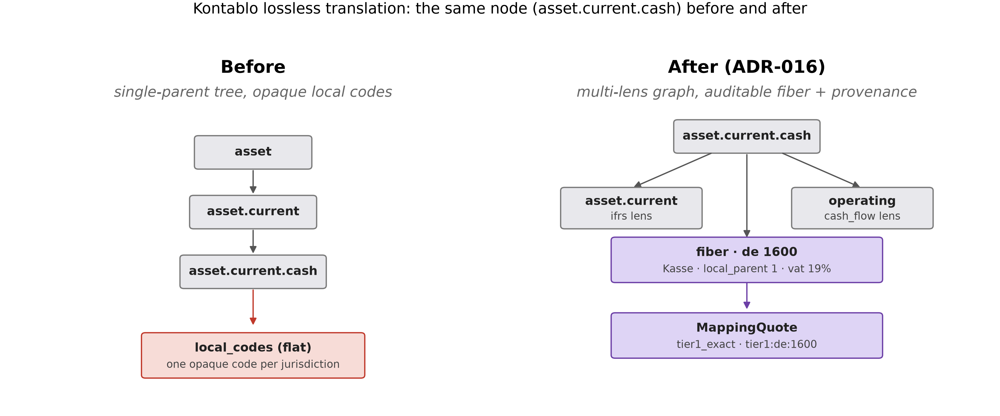

# Kontablo v0.3.0 — Lossless translation, entry-level

This is a **minor release** (backward-compatible new features) over
[v0.2.1](release-notes-v0.2.1.md). The headline: **no local account, no local
chart structure, and no consolidated figure is discarded without an explicit,
typed record.** ADR-016 closes the gap between the "graph, not tree" principle
and what the code actually did — the ontology stops being a single-parent tree
relabeled as a graph, and the translation from a local chart of accounts to a
Kontablo node stops throwing away the local structure and the resolution
decision behind it.

No headline validation numbers changed: still **195** sovereign jurisdictions,
**60** statutory-chart overlays (**56** exercised against primary-source-cited
charts), and the **75 entities / 68 jurisdictions / 97.3% deterministic**
validation. The claims-evidence CI gate reproduces them byte-for-byte — every
change in this release is additive.

## What's new since v0.2.1

### Entry-level provenance (the FXQuote pattern, applied to mapping)
- New `MappingQuote` (`core/harness/provenance.py`), mirroring the existing
  `FXQuote` audit pattern: every resolved entry now carries which
  deterministic tier answered, the exact rule that fired
  (`tier1:<jurisdiction>:<code>` / `tier2:<node>:<keyword>`), confidence, and
  the original local-currency amounts (the rounded USD figures are not
  invertible through the FX rate).
- Surfaced on every face: REST `/consolidation` gains `mapping_audit[]` and
  `source_entries` per line; gRPC's `ConsolidationResponse` gains both
  `mapping_audit` **and** the `fx_audit` it never had; MCP's
  `consolidate_trial_balances` gains the same `mapping_audit[]`.
  `SingleMappingResponse`/`MapAccountResponse` gain a `tier` field so REST and
  gRPC use the same vocabulary MCP already had.
- `ConsolidationResult.lineage()` reconstructs every consolidated line from its
  resolved source entries (its *fiber*) — the FX and mapping quotes make each
  figure traceable back to a specific local row, not just an aggregate.

### Localization schema v2 — the local chart keeps its own shape
- First formal JSON Schema for localization mapping files
  (`core/schemas/localization_mapping.schema.json`). All new fields are
  **optional**: `local_parent` (the local chart's own tree edge, e.g. SKR04
  Kontenklassen, SPED groupings), `facets` (named analytical dimensions a
  coarser Kontablo node would otherwise flatten — geography, tax regime, VAT
  rate, contra polarity), `aggregation_group` (declares an explicit N:1 fiber,
  e.g. gross receivables + contra allowance → one net node).
- Three exemplar jurisdictions populated: `mx` (SAT Anexo 24), `br` (SPED),
  `de` (SKR04). The remaining ~196 localization files are an explicit
  incremental backlog, not rewritten wholesale.

### The graph stops being a relabeled tree
- Level-3 ontology nodes now carry `groupings` — parallel rollup lenses over
  the same UUIDs. The primary `ifrs` lens is composed from the existing
  `parent` field (one source of truth); the first additional lens is
  `cash_flow` (operating / investing / financing).
- `rollup(accounts, lens)` partitions the ontology under any lens;
  `node_fiber()` answers the inverse question — which local codes, across
  jurisdictions, collapse into a given node — enriched with the v2 structure
  when a jurisdiction is given. Exposed as the MCP tool `get_node_fiber` and
  REST `GET /accounts/{id}/fiber`.
- `relations.also_rolls_up_to` (defined in the account schema since day one,
  never validated) finally gets a referential-integrity test.

### The gate: zero silent losses, CI-enforced
- New `scripts/roundtrip_audit.py`, run on the exact synthetic dataset behind
  the published validation numbers: proves conservation (441 entries in, 441
  resolved out), byte-for-byte reconstruction of every local trial balance from
  lineage alone, fiber consistency (every consolidated line equals the sum of
  its resolved entries), and a fully typed loss ledger (ontology collisions,
  non-code placeholders, escalations, CRA flags — nothing silent).
  `silent_losses == 0`.
- New CI step runs the audit next to the existing claims-evidence gate; either
  one failing blocks the build.

## Not in this release (honest scope)
- Facet/hierarchy population for the remaining ~196 localization files —
  incremental, tracked as backlog.
- The preprint's λ-labeled property-graph claims (fiscal/functional/
  consolidation-role facet families) are now *partially* backed by data
  (facets, groupings) but full reconciliation is deferred to a future paper
  revision, not edited retroactively in this release.
- A2A and AP2 remain asserted-but-unimplemented (unchanged from v0.2.1).

## License
**Core**: Business Source License 1.1 — converts to Apache 2.0 on **2030-06-18**.
**ERPNext/Odoo connectors**: Apache 2.0. See `LICENSE` and `LICENSING.md`.

## Citation
Concept DOI (always resolves to the latest version):
[10.5281/zenodo.20738795](https://doi.org/10.5281/zenodo.20738795) ·
SSRN [abstract 6960598](https://papers.ssrn.com/sol3/papers.cfm?abstract_id=6960598).

## Decision record
[`docs/adr/016-lossless-translation-and-provenance.md`](../adr/016-lossless-translation-and-provenance.md)
— the three distinct information losses (entry lineage, local structure,
semantic coarsening), which are eliminated versus which are inherent-but-typed,
and why every change here is additive to the pinned validation numbers.

## Release checklist (owner-gated — Christian)
The code/docs are ready on `main`. Because `git push` of a tag is blocked by the
repo ruleset (immutable releases), create the tag **through the Release UI**, not
the CLI:
1. GitHub → Releases → **Draft a new release**.
2. **Choose a tag** → type `v0.3.0` → "Create new tag: v0.3.0 on publish".
3. **Target:** `main` (server-side tip — guarantees the correct commit).
4. Title `Kontablo v0.3.0 — Lossless translation, entry-level`; body = this file.
5. **Publish** → Zenodo auto-archives and mints a **v0.3.0 version DOI** under the
   concept DOI. Add that version DOI to `CITATION.cff` `identifiers` afterward
   (and relabel the current v0.2.1 identifier's description from "current" if
   it still says so).
6. Optional coordinated posts per the internal launch playbook.
