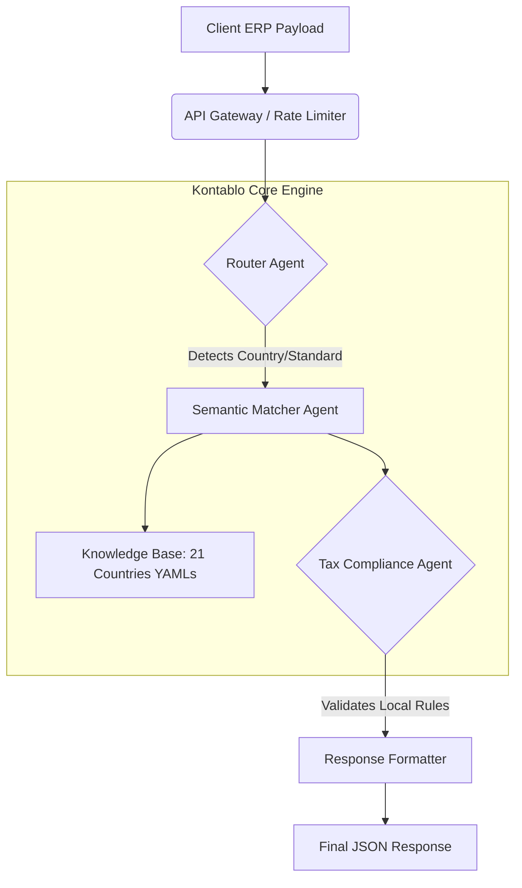

# OpenSpec: SAT-Kontablo Mapping MicroSaaS API
**Version:** 1.0.0-draft
**Status:** In Design (Spec Freeze Pending)

## 1. Overview
The SAT-Kontablo Mapping MicroSaaS is an AI-powered engine designed to automatically map any local chart of accounts (from ERPs like SAP, Oracle, Sage, Xero, QuickBooks) to the universal Kontablo UUID Ontology. It leverages a Multi-Agent Architecture trained on 21 global accounting standards.

## 2. Agent Architecture

The system utilizes a specialized multi-agent pipeline to process incoming financial metadata.



### Agent Roles:
1.  **Router Agent:** Analyzes the payload (currency, language, account structure) to infer the correct standard (e.g., PCG for France, SPED for Brazil, GST for India).
2.  **Semantic Matcher Agent:** Uses RAG (Retrieval-Augmented Generation) against the YAML localization files to find the shortest semantic distance between the local account name/code and a Kontablo UUID.
3.  **Tax Compliance Agent:** Intervenes for complex edge cases (e.g., enforcing `40000000-0000-4000-8000-000000000001` for India's Multi-slab GST output instead of generic VAT).

---

## 3. Endpoints

### 3.1 Batch Mapping
`POST /api/v1/map`

Process a full chart of accounts in a single request.

**Request Payload (JSON):**
```json
{
  "company_id": "req-12345",
  "context": {
    "country": "BR",
    "industry": "retail"
  },
  "accounts": [
    {
      "local_code": "1.01.01.01",
      "local_name": "Caixa Geral",
      "nature": "debit"
    },
    {
      "local_code": "2.01.05.03",
      "local_name": "PIS a Recolher",
      "nature": "credit"
    }
  ]
}
```

**Response Payload (JSON):**
```json
{
  "status": "success",
  "mapped_accounts": [
    {
      "local_code": "1.01.01.01",
      "kontablo_uuid": "00000000-0000-4000-8000-000000000101",
      "confidence_score": 0.99,
      "agent_justification": "Exact semantic match for 'Cash' identified in Portuguese."
    },
    {
      "local_code": "2.01.05.03",
      "kontablo_uuid": "30000000-0000-4000-8000-000000000001",
      "confidence_score": 0.95,
      "agent_justification": "Tax compliance agent enforced Brazil-specific PIS/COFINS UUID instead of generic tax liability."
    }
  ],
  "unmapped_accounts": []
}
```

### 3.2 Single Account Suggestion (Real-time Typeahead)
`POST /api/v1/suggest`

Used by ERP UI components to suggest UUIDs as the accountant types a new account name.

---

## 4. Security & Data Privacy

*   **Zero PII Retention:** The API does absolutely not require transactional data (amounts, dates, vendor names). It only requires chart metadata (Codes, Names, Hierarchy). Payload data is immediately dropped after mapping is complete.
*   **Opt-out Telemetry:** Users can opt-out of their corrected mappings being used to reinforce the Semantic Matcher Agent.
